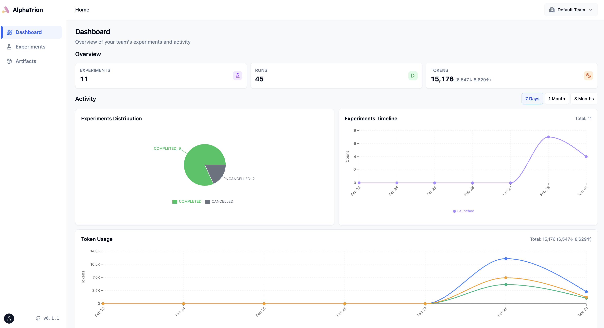

<p align="center">
  <picture>
    <source media="(prefers-color-scheme: dark)" srcset="https://raw.githubusercontent.com/inftyai/alphatrion/main/site/images/alphatrion.png">
    
  </picture>
</p>

<h3 align="center">
Open, modular framework to build GenAI applications.
</h3>

[](https://github.com/mkenney/software-guides/blob/master/STABILITY-BADGES.md#alpha)
[](https://github.com/inftyai/alphatrion/releases/latest)

**AlphaTrion** is an open-source framework to help build GenAI applications, including experiment tracking, adaptive model routing, prompt optimization, performance evaluation and so on. The name comes after the oldest and wisest Transformer - AlphaTrion.

*Still under active development.*

## Concepts

- **Team**: A Team is the highest-level organizational unit in AlphaTrion. It represents a group of users collaborating on projects and experiments.
- **Project**: A Project is a namespace-level abstraction that contains multiple experiments. It helps organize experiments related to a specific goal or topic.
- **Experiment**: An Experiment is a logic-level abstraction for organizing and managing a series of related runs. It allows users to group runs that share a common purpose or configuration.
- **Run**: A Run is a real execution instance of an experiment. It represents the actual execution of the code with the specified configuration and hyperparameters defined in the experiment.

## Quick Start

### Install from PyPI

```bash
pip install alphatrion
```

### Install from Source

* Git clone the repository
* Run `source start.sh` to activate the virtual environment.


### Initialize the Environment

Run the following command for setup:

```bash
cp .env.example .env & make up
```
You can login to pgAdmin at `http://localhost:8081` to see the Postgres database with following credentials. Remember to register the server first.

```shell
Email:       alphatrion@inftyai.com
Password:    alphatr1on
ServerName:  alphatrion
HostName:    postgres
ServerPWD:   alphatr1on
```

You can also visit the Docker Registry UI at `http://localhost:80` to see the local registry where the built images are stored.

Next, init the environment with a user and team:

```bash
alphatrion init  # see -h for options to specify username, email and team name
```

You will see the generated user ID in the console. Use this ID to initialize the AlphaTrion environment in your code later.

### Run a Simple Experiment

Below is a simple example with two approaches demonstrating how to create an experiment and log performance metrics.

```python
import alphatrion as alpha
from alphatrion import experiment, project

# Use the user ID generated from the `alphatrion init` command.
alpha.init(user_id=<user_id>)

async def your_task():
  # Run your code here then log metrics.
  await alpha.log_metrics({"accuracy": 0.95})

async with project.Project.setup(name="my_project"):
  async with experiment.CraftExperiment.start(name="my_experiment") as exp:
    task = exp.run(your_task) # use lambda or partial if you need to pass arguments to your_task
    await task.wait()
```

### View Dashboard



The dashboard provides a web interface to explore projects, experiments, runs, and metrics through an intuitive UI.

#### Launch Dashboard

```bash
# Start the backend server (in one terminal)
alphatrion server

# Launch the dashboard (in another terminal)
alphatrion dashboard
```

The dashboard will automatically open in your browser at `http://127.0.0.1:5173`.

**Options:**
- `--port <PORT>`: Run on a custom port (default: 5173)
- `--no-browser`: Don't automatically open the browser

Example:
```bash
alphatrion dashboard --port 8080 --no-browser
```

**Documentation:**
- [Dashboard Setup Guide](./docs/dashboard/setup.md) - Complete setup and troubleshooting guide
- [Dashboard CLI Guide](./docs/dashboard/dashboard-cli.md) - Using the dashboard CLI command
- [Dashboard Architecture](./docs/dashboard/dashboard-architecture.md) - Technical architecture and deployment patterns

### Cleanup

```bash
make down
```

## Contributing

We welcome contributions! Please refer to [developer.md](./docs/dev/development.md) for more information on how to set up your development environment and contribute to the project.

[](https://www.star-history.com/#inftyai/alphatrion&Date)
