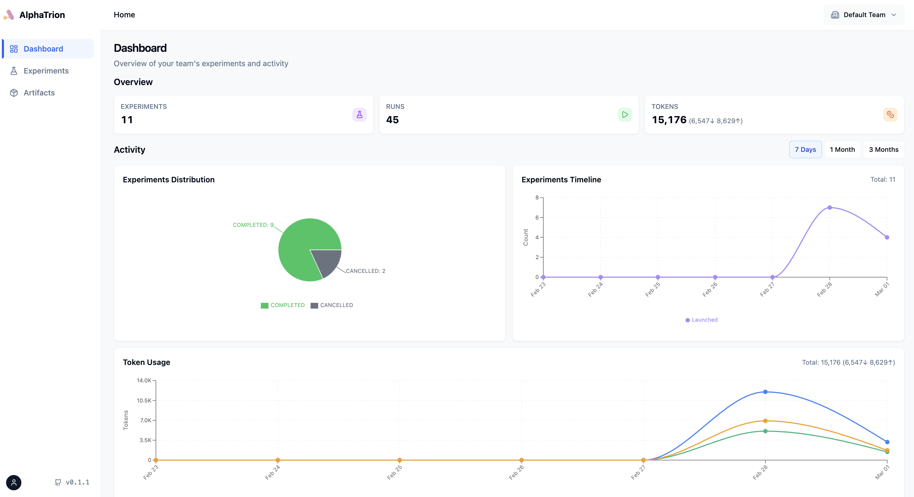

<p align="center">
  <picture>
    <source media="(prefers-color-scheme: dark)" srcset="https://raw.githubusercontent.com/inftyai/alphatrion/main/site/images/alphatrion.png">
    
  </picture>
</p>

<h3 align="center">
Open, modular framework to build and optimize GenAI applications
</h3>

[](https://github.com/mkenney/software-guides/blob/master/STABILITY-BADGES.md#alpha)
[](https://github.com/inftyai/alphatrion/releases/latest)

**AlphaTrion** is an open-source framework for building and optimizing GenAI applications. Track experiments, monitor performance, analyze model usage, and manage artifacts—all through an intuitive dashboard. Named after the oldest and wisest Transformer.

*Currently in active development.*

## Features

- **🔬 Experiment Tracking** - Organize and manage ML experiments with hierarchical teams, experiments, and runs
- **📊 Performance Monitoring** - Track metrics, visualize trends, and monitor experiment status in real-time
- **🔍 Distributed Tracing** - Automatic OpenTelemetry integration for LLM calls with detailed span analysis
- **💰 Token Usage Analytics** - Monitor daily token consumption across input/output with historical trends
- **🤖 Model Distribution** - Analyze request patterns and usage across different AI models
- **📦 Artifact Management** - Store and version execution results, checkpoints, and model outputs
- **🎯 Interactive Dashboard** - Modern web UI for exploring experiments, metrics, and traces
- **🔌 Easy Integration** - Simple Python API with async/await support

## Core Concepts

- **Team** - Top-level organizational unit for user collaboration
- **Experiment** - Logical grouping of runs with shared purpose, organized by labels
- **Run** - Individual execution instance with configuration and metrics

## Quick Start

### 1. Installation

```bash
# From PyPI
pip install alphatrion

# Or from source
git clone https://github.com/inftyai/alphatrion.git && cd alphatrion
source start.sh
```

### 2. Setup Infrastructure

```bash
# Start PostgreSQL, ClickHouse, and Registry
cp .env.example .env
make up

# Initialize your team and user
alphatrion init  # Use -h for custom options
```

Save the generated user ID—you'll need it to track experiments.

**Optional Tools:**
- pgAdmin: `http://localhost:8081` (alphatrion@inftyai.com / alphatr1on)
- Registry UI: `http://localhost:80`

### 3. Track Your First Experiment

```python
import alphatrion as alpha
from alphatrion import experiment

# Initialize with your user ID
alpha.init(user_id="<your_user_id>")

async def my_task():
    # Your ML code here
    await alpha.log_metrics({"accuracy": 0.95, "loss": 0.12})

async with experiment.CraftExperiment.start(name="my_experiment") as exp:
    task = exp.run(my_task)
    await task.wait()
```

### 4. Launch Dashboard

```bash
# Start backend server (terminal 1)
alphatrion server

# Launch dashboard (terminal 2)
alphatrion dashboard
```

Access the dashboard at `http://127.0.0.1:5173` to explore experiments, visualize metrics, and analyze traces.



### 5. View Traces

AlphaTrion automatically captures distributed tracing data for all LLM calls, including latency, token usage, and span relationships.


### 6. Other APIs

- **log_params**: Track hyperparameters and configuration settings
- **log_metrics**: Record performance metrics and visualize trends
- **log_artifacts**: Store and manage files, checkpoints, and model outputs


### Cleanup

```bash
make down
```

## Documentation

- **Dashboard**: [Setup Guide](./docs/dashboard/setup.md) | [CLI Reference](./docs/dashboard/dashboard-cli.md) | [Architecture](./docs/dashboard/dashboard-architecture.md)
- **Development**: [Contributing Guide](./docs/dev/development.md)

## Contributing

We welcome contributions! Check out our [development guide](./docs/dev/development.md) to get started.

[](https://www.star-history.com/#inftyai/alphatrion&Date)
